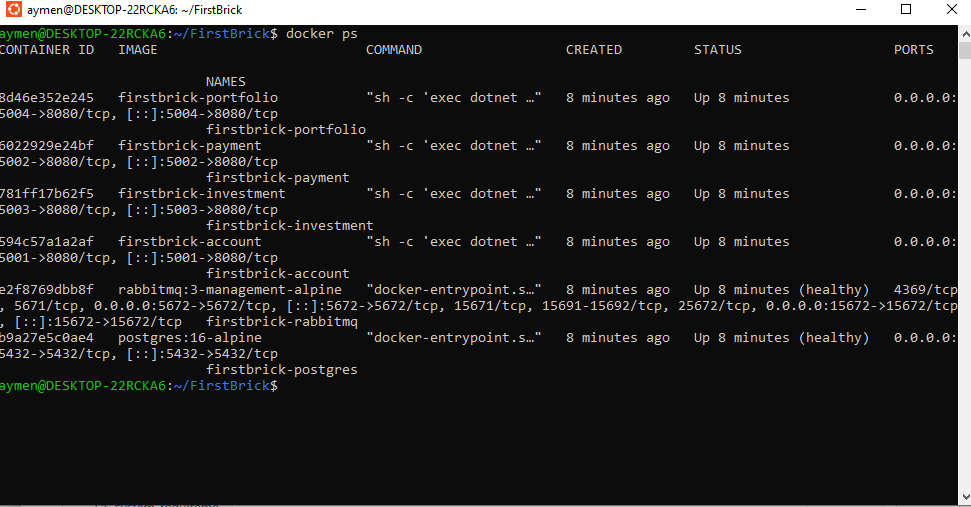
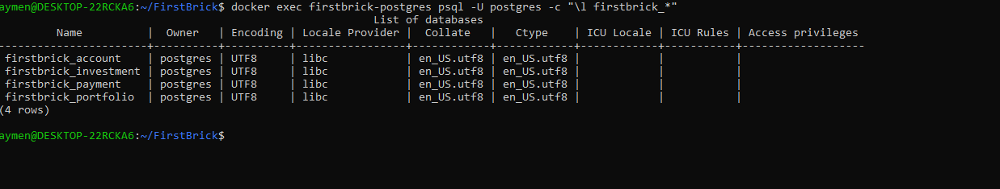
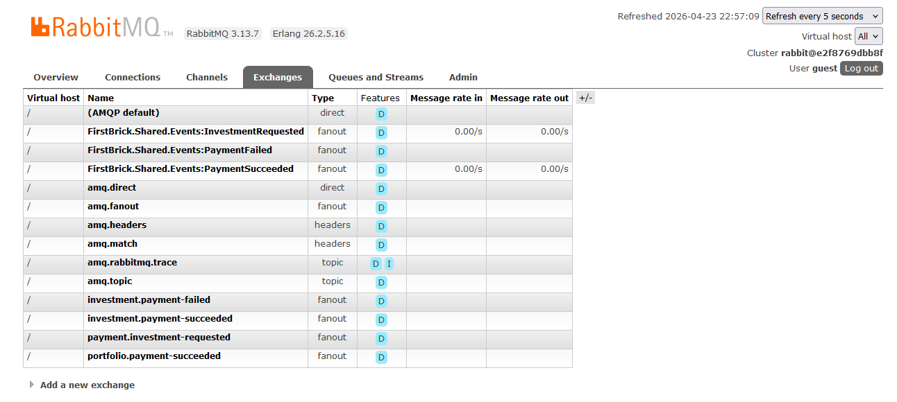
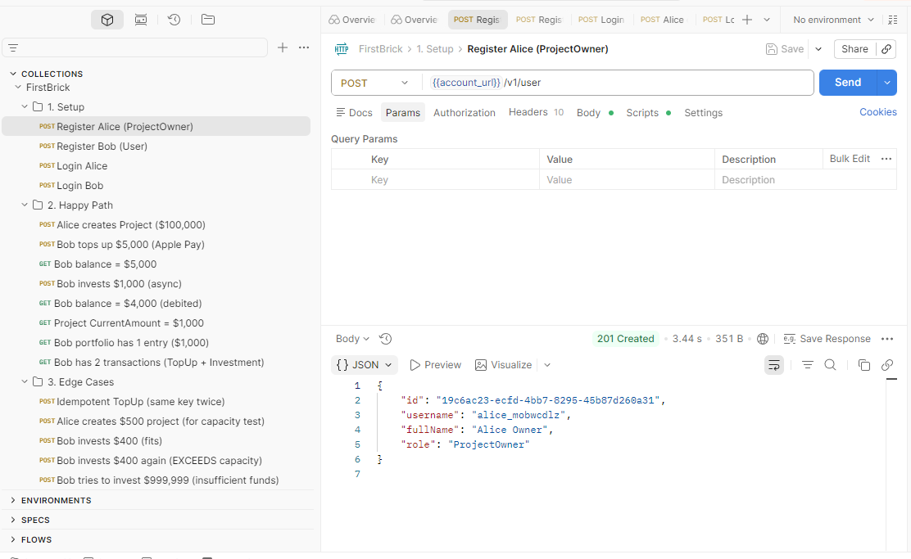

# FirstBrick

A microservice implementation of a real estate crowdfunding platform.

## Tech Stack

- **.NET 10** / ASP.NET Core Web API
- **PostgreSQL 16** — one database per service
- **RabbitMQ 3** with **MassTransit** — async event choreography
- **EF Core 10** with Npgsql — migrations applied automatically on startup
- **JWT Bearer** — shared issuer/audience/secret across services

## Services

| Service     | Port | Database                | Responsibility                                   |
|-------------|-----:|-------------------------|--------------------------------------------------|
| Account     | 5001 | `firstbrick_account`    | Registration, login, profile. Mints JWTs.        |
| Payment     | 5002 | `firstbrick_payment`    | Wallet balance, ledger of transactions, top-ups. |
| Investment  | 5003 | `firstbrick_investment` | Project catalog, invest flow, capacity control.  |
| Portfolio   | 5004 | `firstbrick_portfolio`  | Per-user aggregated view (read model).           |

Each service owns its own database. No service writes to another service's database.

## Running (Docker)

```bash
docker compose up --build -d
```

Starts Postgres + RabbitMQ (with healthchecks) and all four services. Exposed ports:

- Account http://localhost:5001
- Payment http://localhost:5002
- Investment http://localhost:5003
- Portfolio http://localhost:5004
- RabbitMQ UI http://localhost:15672 (guest / guest)

Logs: `docker compose logs -f <service>`. Stop: `docker compose down`.



## API Reference

Every endpoint except `POST /v1/user` and `POST /v1/login` needs an `Authorization: Bearer <jwt>` header.

### Account (5001)
| Method | Path                  | Notes                                              |
|--------|-----------------------|----------------------------------------------------|
| POST   | `/v1/user`            | Register. Body: `{username, password, fullName, role?}`. `role` may be `User` (default) or `ProjectOwner`. |
| POST   | `/v1/login`           | Returns `{accessToken, expiresAtUtc}`.             |
| GET    | `/v1/user/{user_id}`  | Own profile only. Other user ids return `403`.     |
| PUT    | `/v1/user/{user_id}`  | Update `FullName`.                                 |

### Investment (5003)
| Method | Path            | Notes                                                  |
|--------|-----------------|--------------------------------------------------------|
| POST   | `/v1/project`   | `ProjectOwner` only. `OwnerId` derived from JWT `sub`. |
| GET    | `/v1/projects`  | Paginated catalog (`page`, `pageSize`).                |
| POST   | `/v1/invest`    | Body: `{projectId, amount}`. Returns `202 Accepted`.   |

### Payment (5002)
| Method | Path                   | Notes                                                |
|--------|------------------------|------------------------------------------------------|
| POST   | `/v1/ApplepayTopup`    | Body: `{amount, idempotencyKey}`.                    |
| GET    | `/v1/balance`          | Current wallet balance for the caller.               |
| GET    | `/v1/transactions`     | Paginated financial statement (`page`, `pageSize`).  |

### Portfolio (5004)
| Method | Path                          | Notes                                     |
|--------|-------------------------------|-------------------------------------------|
| GET    | `/v1/portfolio`               | List of invested projects for the caller. |
| GET    | `/v1/portfolio/{project_id}`  | Aggregated entry for one project.         |

Each entry has `projectId`, `projectTitle`, `totalInvested`, `lastUpdatedUtc`.

The brief mentions "portfolio performance". In this project that just means how much
a user has put into each project. There is no property valuation, rent, or payout
data in the system, so numbers like ROI or gain/loss are not computed.

## Database Schema

Each service owns its tables. All updates inside a service run in a single database transaction.

| Service    | Table                 | Columns                                                                                            |
|------------|-----------------------|----------------------------------------------------------------------------------------------------|
| Account    | `Users`               | `Id`, `Username` (unique), `PasswordHash`, `FullName`, `Role`                                      |
| Investment | `Projects`            | `Id`, `OwnerId`, `Title`, `TargetAmount`, `CurrentAmount` (check: `CurrentAmount <= TargetAmount`) |
| Investment | `InvestmentRequests`  | `Id`, `UserId`, `ProjectId`, `Amount`, `Status` (`Pending`/`Success`/`Failed`), `CreatedAtUtc`     |
| Payment    | `Wallets`             | `UserId` (PK), `Balance`                                                                           |
| Payment    | `Transactions`        | `Id`, `UserId`, `Amount`, `Type` (`TopUp`/`Investment`), `Status`, `IdempotencyKey` (unique), `InvestmentRequestId` (unique when present), `CreatedAtUtc` |
| Portfolio  | `PortfolioView`       | `(UserId, ProjectId)` PK, `TotalInvested`, `ProjectTitle`, `LastUpdatedUtc`                        |
| Portfolio  | `ProcessedInvestments`| `RequestId` (PK), `UserId`, `ProjectId`, `AppliedAtUtc` — used to skip duplicate events           |

One Postgres instance, one database per service. No shared tables, no cross-service foreign keys.



## Invest Flow (End-to-End)

Simple view:

```
Client → Investment → (event) → Payment → (event) → Investment + Portfolio
```

Step by step:

1. **Client** calls `POST /v1/invest` with a `projectId` and `amount`.
2. **Investment Service** reserves the capacity on the project in one transaction:
   - Project not found → `404 Not Found`.
   - Project is full (would go over `TargetAmount`) → `409 Conflict`.
   - Otherwise it saves a `Pending` investment request, publishes `InvestmentRequested`, and returns `202 Accepted`.
3. **Payment Service** picks up the event and, in one transaction:
   - Creates the user's wallet if it doesn't exist yet.
   - Records a `Transaction` of type `Investment`.
   - If the balance is enough → debit the wallet, mark it `Success`, publish `PaymentSucceeded`.
   - If not → mark it `Failed`, publish `PaymentFailed`.
4. **Investment Service** reacts to the outcome:
   - `PaymentSucceeded` → mark the request `Success`.
   - `PaymentFailed` → mark the request `Failed` and give the reserved amount back to the project.
5. **Portfolio Service** reacts to `PaymentSucceeded`:
   - Skips if it already handled this request (same `RequestId`).
   - Reads `ProjectTitle` directly from the event — no HTTP call.
   - Adds the amount to the user's `PortfolioView` row for that project.

### Events (shared, `src/Shared/FirstBrick.Shared/Events`)

- `InvestmentRequested { UserId, ProjectId, Amount, RequestId, ProjectTitle }` — Investment → Payment.
- `PaymentSucceeded    { UserId, ProjectId, Amount, RequestId, ProjectTitle }` — Payment → Investment, Portfolio.
- `PaymentFailed       { UserId, ProjectId, Amount, RequestId, ProjectTitle, Reason }` — Payment → Investment.

`ProjectTitle` is embedded in every event so downstream consumers (Portfolio, etc.)
stay fully event-driven and never need to call Investment synchronously.

MassTransit creates three event exchanges plus one queue per consumer at startup:



## Consistency & Reliability

- **No over-funding.** Step 2 uses a conditional SQL update, so two people investing at the same time can't push the project past its target.
- **Retries are safe.** Top-ups use a key the client sends. Investment payments use the request id. Portfolio remembers which request ids it already applied. A retry never double-charges or double-credits.
- **Failure cleanup.** If the payment fails, Investment puts the reserved amount back on the project.
- **Broker retries.** MassTransit retries each consumer 5 times, 2 seconds apart.
- **Lazy wallets and portfolio rows.** They are created the first time they are needed, so there is no "user registered" event to worry about.

## Security

- Every service checks the JWT on every request.
- The `sub` claim is the user id. The `role` claim is `User` or `ProjectOwner`.
- A user can only read or update their own data. Any other user id returns `403`.
- Only a `ProjectOwner` can create a project.
- Passwords are hashed with BCrypt.
- All services share the same JWT issuer, audience, and secret in dev.

## Error handling

All four services share one exception handler
(`src/Shared/FirstBrick.Shared/ErrorHandling/GlobalExceptionHandler.cs`).
It turns any unhandled exception into a JSON error response that looks the same
on every service.

A failed request returns `application/problem+json`:

```json
{
  "type": "https://httpstatuses.io/500",
  "title": "Internal server error",
  "status": 500,
  "instance": "POST /v1/invest",
  "traceId": "00-4bf92f3577b34da6a3ce929d0e0e4736-00f067aa0ba902b7-01"
}
```

How exceptions are mapped:

| Exception                     | Status |
|-------------------------------|-------:|
| `ArgumentException`           | 400    |
| `UnauthorizedAccessException` | 401    |
| `KeyNotFoundException`        | 404    |
| `TimeoutException`            | 504    |
| `NotImplementedException`     | 501    |
| anything else                 | 500    |

## Communication Matrix

| Type     | Caller          | Callee           | Reason                                           |
|----------|-----------------|------------------|--------------------------------------------------|
| Sync REST| Client          | Any service      | Normal API calls                                 |
| Async MQ | Investment      | Payment          | `InvestmentRequested` (carries `ProjectTitle`)   |
| Async MQ | Payment         | Investment       | `PaymentSucceeded` / `PaymentFailed`             |
| Async MQ | Payment         | Portfolio        | `PaymentSucceeded`                               |

## Testing

A ready-to-run Postman collection lives at `docs/postman/FirstBrick.postman_collection.json`
(see `docs/postman/README.md` for import + environment setup). It covers three folders:

- **Setup** — register + login for two users (a `ProjectOwner` and a `User`).
- **Happy Path** — create project, top-up, invest async, verify balance / transactions / portfolio.
- **Edge Cases** — idempotent top-up, capacity exceeded, insufficient funds.


